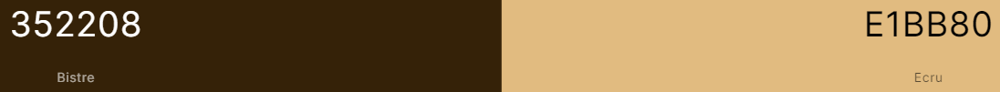
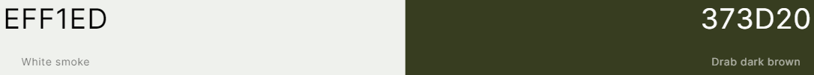
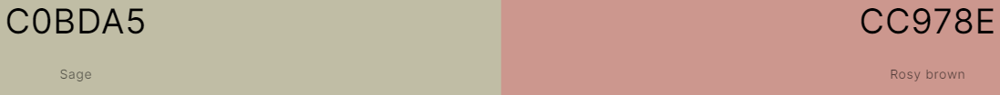
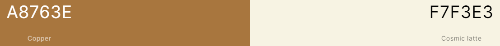

# Colour Theory

## Why is colour theory important

Colour theory/ figuring out what colours I should use when designing the app is important as many factors rely on it. Firstly, having a colour scheme would allow a consistent theme across an entire app page, as well as helping to brand the app. Secondly, certain colours have negative connotation in certain cultures. Although it is not easy to appease everybody, having colours that have more positive connotations is a good idea. The colours also have to be bright/not restrictive enough that people with eyesight problems don't struggle with them.

## Possible colour matches

### 1

### 2

### 3

### 4

## Analysis

Automatically, 4 is a colour scheme that stands out most. Representing caramel and coffee colours, it's a design and colour that most people can see. They also a very nice contrast for use. 3 is a good colour scheme, however the two colours together seem very bland. Number 1 is something I like to percieve as the darker form of 4. I think the colours can still be used, but they would be used in secondary use to number 4.
